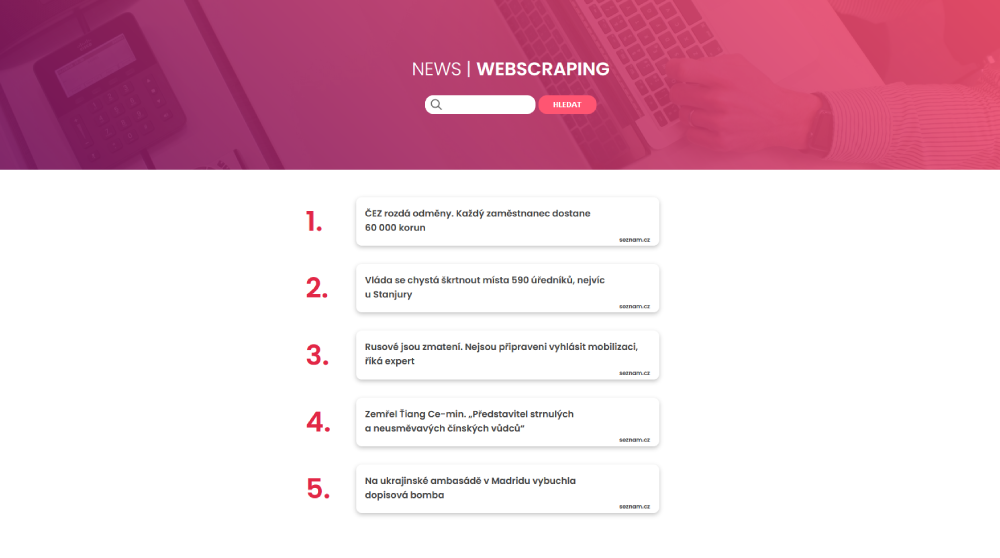

# Django news webscraping app
App for web scraping from News websites. User can filter articles according to the entered keyword.

At the moment, app scrapes news from Denik.cz, Aktualne.cz, Seznam.cz and Idnes.cz front pages.

Interface is in Czech language.



## Installation

1. Install requirements.txt from project root directory with:
    ```sh
    pip install -r requirements.txt
    ```
2. Run program from project root directory with:
    ```sh
    python manage.py runserver
    ```

3. Access localhost in your browser at (http://127.0.0.1:8000/)